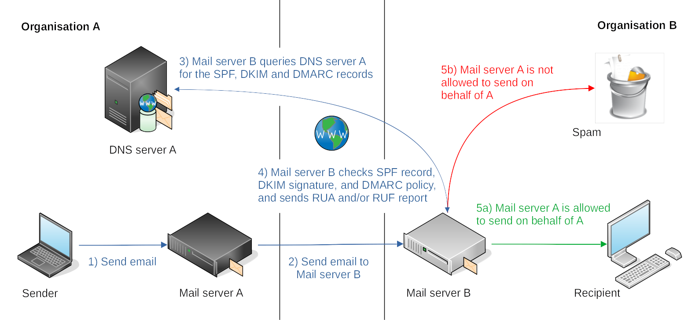

Hardening Mailserver
==================================================

Version 0.1: Notes on setting up a mailserver to detect phishing attacks and prevent MitM attacks. The below configurations were
for a debian 9, and need to be updated and DMARC added. A work in progress ...

.. toctree::
   :glob:
   :maxdepth: 1
   :includehidden:
   :caption: Mail servers

   docs/servers/README.md
   docs/servers/*

.. toctree::
   :glob:
   :maxdepth: 1
   :includehidden:
   :caption: MTA

   docs/mta/README.md
   docs/mta/*

.. toctree::
   :glob:
   :maxdepth: 1
   :includehidden:
   :caption: DNSSEC

   docs/dnssec/README.md

.. toctree::
   :glob:
   :maxdepth: 1
   :includehidden:
   :caption: TLS

   docs/tls/README.md
   docs/tls/tls.md
   docs/tls/*

.. toctree::
   :glob:
   :maxdepth: 1
   :includehidden:
   :caption: SPF

   docs/spf/README.md
   docs/spf/*

.. toctree::
   :glob:
   :maxdepth: 1
   :includehidden:
   :caption: DKIM

   docs/dkim/README.md
   docs/dkim/*

.. toctree::
   :glob:
   :maxdepth: 1
   :includehidden:
   :caption: DMARC

   docs/dmarc/README.md
   docs/dmarc/*

.. toctree::
   :caption: Links

   Blue Team <https://tymyrddin.github.io/blue/>
